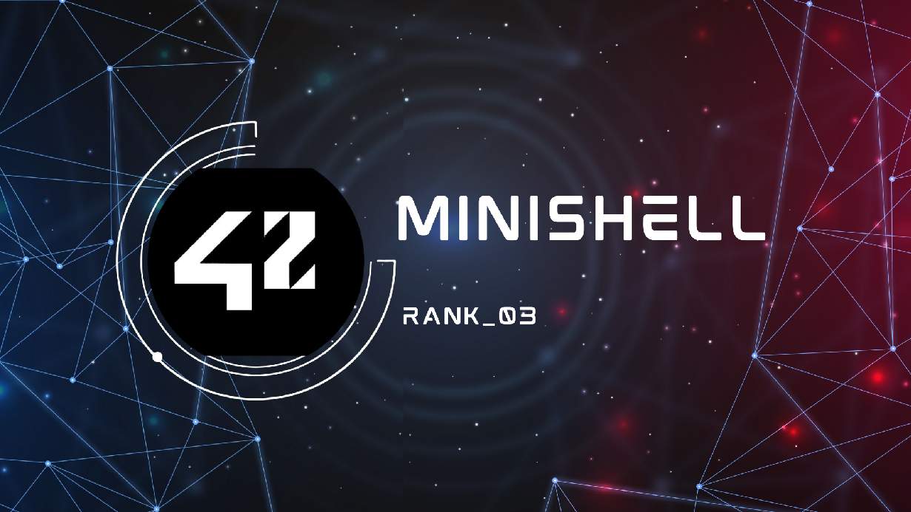

  

<h2>🏁 Goals</h2>

The Minishell project is part of the 42 School curriculum and serves as a gateway to understanding how Unix-based shells work at a fundamental level. The primary goals of this project are:

    Understanding System Programming: Gain hands-on experience with low-level programming concepts, including system calls like fork, execve, pipe, and dup2.

    Process Management: Learn how to manage child processes and handle multiple processes simultaneously through pipes and redirections.

    Shell Fundamentals: Explore how a shell interprets and executes commands, handles environment variables, and manages I/O redirection.

    Error Handling: Build robust error handling to ensure the shell gracefully manages invalid commands, failed system calls, and unexpected user inputs.

    Signal Handling: Understand and implement signal management to create an interactive shell that responds correctly to events like Ctrl+C, Ctrl+D, and Ctrl+\.

Key Learning Objectives

Completing the Minishell project helps develop a deeper understanding of several core programming and system concepts, including:

    File Descriptors: Learn how file descriptors work, how to duplicate them with dup2, and their role in redirection and piping.

    Memory Management: Practice efficient and secure memory handling in C, minimizing leaks and avoiding undefined behavior.

    Parsing and Tokenization: Develop algorithms to parse user input into tokens, handle quotes (" and '), and distinguish between commands, arguments, and operators.

    Environment Management: Explore the manipulation of environment variables, including creating and modifying the envp array.

    Unix Philosophy: Embrace the philosophy of writing programs that do one thing well and interoperate seamlessly.

    Team Collaboration: Collaborate with teammates (if applicable) to plan, debug, and integrate the shell’s features.

Why This Project Is Valuable

The Minishell project bridges theoretical knowledge with practical application. By recreating the behavior of a real shell, learners:

    Gain confidence in working with Unix-based systems.
    Enhance their understanding of how everyday tools like bash work under the hood.
    Prepare themselves for more complex system-level projects, such as web servers, compilers, or operating systems.

Features to Implement

    Command Execution: Support basic commands with arguments.
    Built-in Commands: Implement cd, echo, pwd, export, unset, env, and exit.
    Pipes and Redirections: Enable chaining commands with pipes and manage input/output redirections.
    Signal Handling: Manage user interruptions and EOF signals gracefully.
    Environment Variable Expansion: Parse and expand $VARIABLE when necessary.

This project is a cornerstone in the 42 curriculum, offering an unparalleled opportunity to solidify your understanding of operating systems and Unix programming. Dive in, embrace the challenges, and enjoy the learning process!
